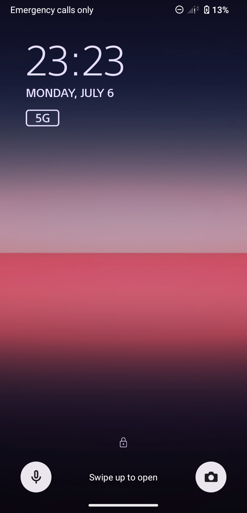
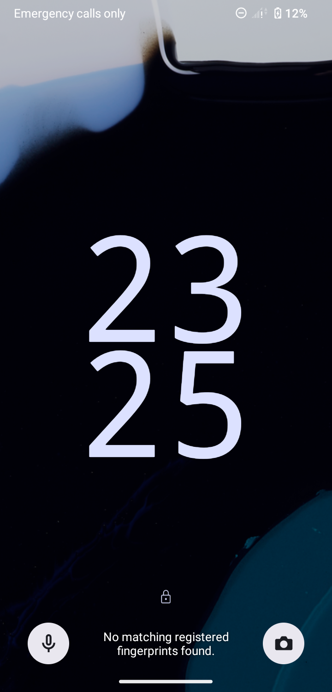
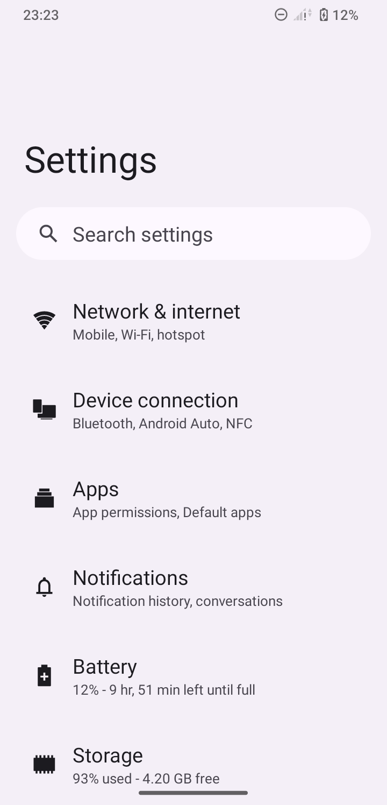
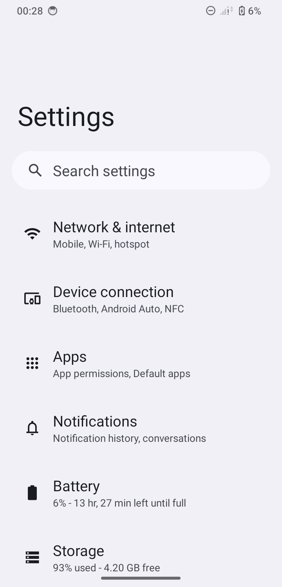

# sonew2aosp

A .NET 8.x WinForms tool to transform your Xperia device's UI to an AOSP (Android Open Source Project)-like experience.

## Features
- **No Root/BLU Required**: Utilizes ADB commands, so no device modification is necessary.
- **Multi-language Support**: English, Japanese, and German language options available during setup.
- **AOSP UI Transformation**: Enables AOSP-style Launcher 3, Settings, and Lock Screen.
- **BigClock (Two-line Clock) Toggle**: Allows switching the lock screen clock display to AOSP style.
- **All-in-One AOSP Mode**: Executes launcher clear, AOSP settings/launcher enablement, and wallpaper setting in a single operation.
- **Overlay Manager**: Provides a GUI for managing device overlays (enable/disable/uninstall/reinstall).

## Screenshots

### Logo


### Lock Screen Before AOSP Transformation


### Lock Screen After AOSP Transformation


### Settings Screen Before AOSP Transformation


### Settings Screen After AOSP Transformation


## Requirements
- Windows OS
- .NET 8.x Runtime
- ADB (Android Debug Bridge) enabled environment
- Xperia device with Android 12 or higher (recommended)

## How to Use
1. Enable "USB Debugging" on your Xperia device and connect it to your PC.
2. Launch the tool.
3. Select your language and start the setup.
4. Click the respective buttons to apply AOSP UI changes.
5. The Overlay Manager allows for detailed customization.
6. When running the All-in-One AOSP Mode, a confirmation dialog for clearing launcher data will appear.

## For Developers
This project is built with .NET 8.0 WinForms.
To build the project, execute the following command:
```bash
dotnet build
```

## Disclaimer
- Compatible with both carrier and global versions, but some features may not work on all models.
- Use of this tool is at your own risk.
